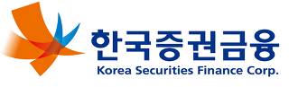
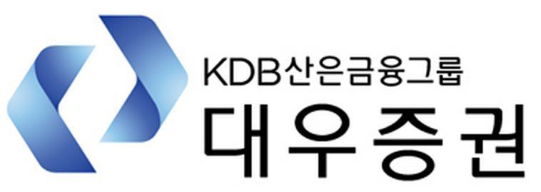
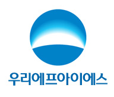
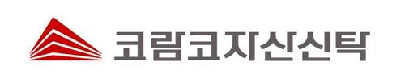
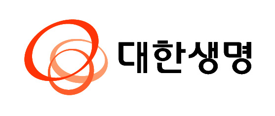

<h2 style="margin-left: 7px;">금융</h2>

 uEngine BPMS는 금융 업무로 개인대출, 기업대출, PF대출, 여신심사 등과 관련하여 프로세스별, 업무별, 개인별, 조직별 효율을 측정하거나 실시간 모니터링을 관리할 수 있습니다.  
또한 사전심사 범위의 축소 및 자동화와 심사 후 사후 처리 업무에 대해 효율성을 증대할 수 있습니다. 

<table>
    <tr>
        <th></th>
        <th></th>
         <th></th>
    </tr>
    <tr>
        <th></th>  
        <th></th>
    </tr>
</table>

 
- - -       
    

<h2 style="margin-left: 7px; margin-top: 7px;">보험</h2>

  uEngine BPMS는 SOA(Service Oriented Architecture)를 기반으로 업무 프로세스를 관리할 수 있습니다.  
이는 비기간계 업무뿐 아니라 신상품 개발, 상품계약, 보상, 손해사정 등 폭넓은 영역에 적용할 수 있습니다. 
   
  <table>
    <tr>
      <th></th>
        <th></th>
        <th></th>
    </tr>

  </table>
