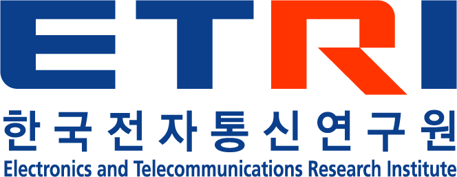
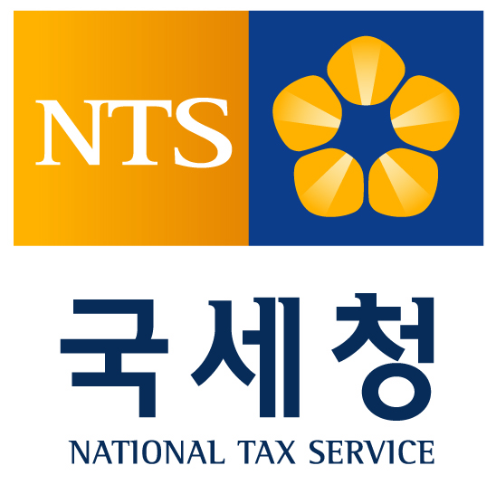
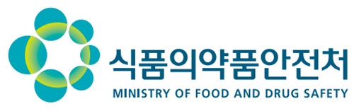
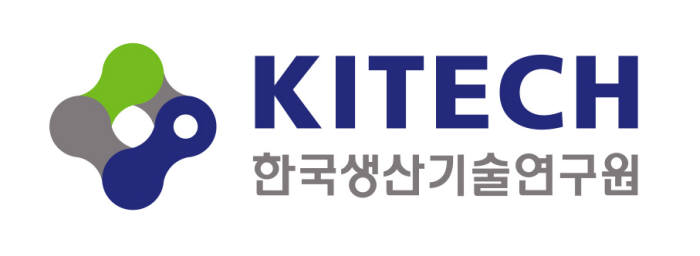
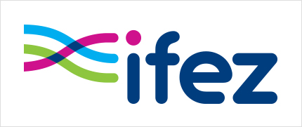
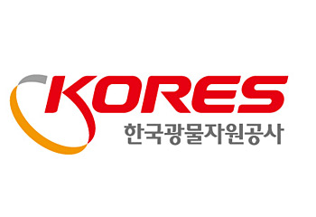
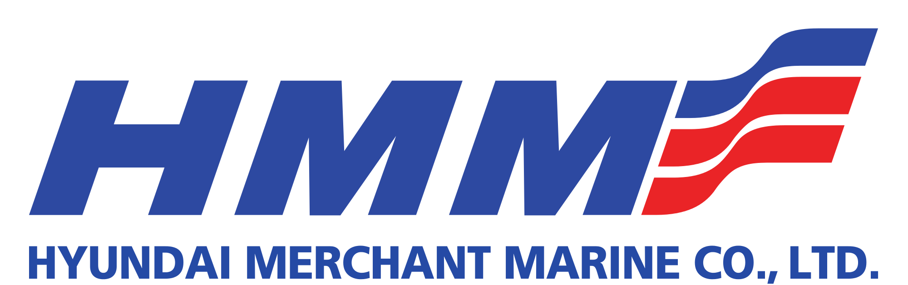
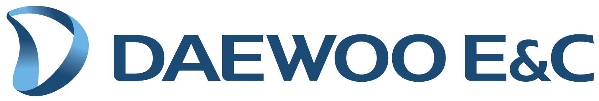

<h2 style="margin-left: 7px;">공공기관</h2>

 uEngine BPMS는 업무별 표준 프로세스를 이용하여 정부 공공 기관의 여러 프로젝트에 적용 구축되어 전자 정부를 실현 할 수 있습니다.  
이는 정부의 전산 문서의 관리와 더불어 포괄적 업무 분담 및 레거시 시스템과의 연계를 이루어 낼 수 있습니다. 

<table>
    <tr>
        <th></th>
        <th></th>
        <th></th>
    </tr>
    <tr>
        <th></th>  
        <th></th>
        <th></th>
    </tr>
    <tr>
        <th></th>  
        <th></th>
        <th></th>
    </tr>
</table>

 
- - -       
 

<h2 style="margin-left: 15px; margin-top: 7px;">제조/건설/물류</h2>

  Engine BPMS는 전자 결재의 기능을 통해 단순한 확인을 위한 결재에서부터 수많은 결재규정을 적용한 복합 결재에 이르기까지 관련 업무의 연계와 더불어 처리 프로세스를 생성하고 관리할 수 있으며, 결재에 관련된 양식의 생성이나 결과물의 관리도 가능합니다.  
그리고 조건별 분기를 나열하여 결과를 도출하는 업무를 수행하거나 특정 룰을 기반으로 심사자를 자동 분배할 수도 있습니다. 
   
<table>
    <tr>
        <th></th>
        <th></th>
        <th></th>
    </tr>
    <tr>
        <th></th>  
        <th></th>
        <th></th>
    </tr>
    <tr>
        <th></th>  
        <th></th>
        <th></th>
    </tr>
</table>
