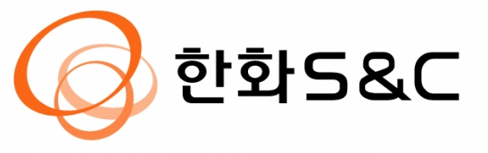
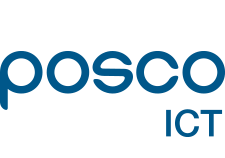
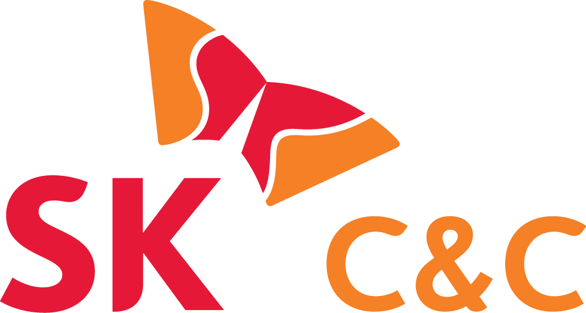

<h2 style="margin-left: 7px;">IT</h2>

 uEngine BPMS는 중복업무 및 단위업무의 비효율성을 제거하고 업무의 투명성을 유지하고 담당자의 작업을 관리 할 수 있습니다.  
   
이를 통해 성과 관리의 기반을 구축할 수 있으며, 또한 Paperless Office를 실현할 수 있습니다. 

<table>
    <tr>
        <th></th>
        <th></th>
         <th></th>
    </tr>
    <tr>
        <th></th>  
        <th></th>
        <th></th>
    </tr>
</table>

 
- - -       
    

<h2 style="margin-left: 7px; margin-top: 7px;">통신</h2>

uEngine BPMS는 단위 업무의 효율성을 높이고, 성과 관리, 상생협력 및 워크플레이스 관리를 할 수 있습니다.    
이는 전사 프로세스의 표준화를 이룰 수 있습니다. 
   
  <table>
    <tr>
      <th></th>
        <th></th>
        <th></th>
    </tr>

  </table>
